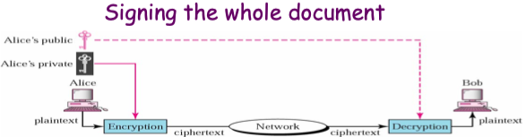

# Network Scurity

## Confidentiality(Cryptography)

only sender, intended receiver should “understand” message contents

– sender encrypts message

– receiver decrypts message

* symmetric - key cryptography

* asymmetric - key cryptography.

## Authentication

Entity authentication is a technique designed to let one party prove the identity of another party. An entity can be a person, a process, a client, or a server. 

The entity whose identity needs to be proved is called the claimant; 
the party that tries to prove the identity of the claimant is called the verifier.

## Message Integrity

**Digital signature** does not provide privacy. If there is a need for privacy, another layer of encryption/decryption must be applied.

## Key Distribution and certification

## Access control : firewalls

## Attacks and counter measures

## Security in many layers

## VPN
