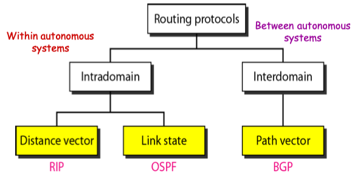
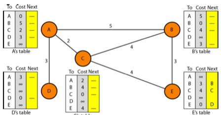
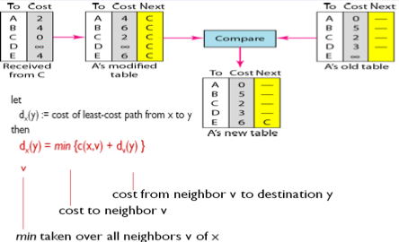
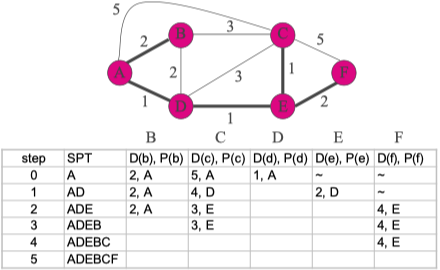

# Internet Protocols

[TOC]

## Routing Protocols

Routing is a process in which the layer 3 devices (either router or layer 3 switches) find the optimal path to deliver a packet from one network to another. Dynamic routing protocols use metric, cost, and hop count to identify the best path from the path available for the destination network. There are mainly 3 different classes of routing protocols: 

### 1.Distance Vector Routing Protocol(RIP)

Routing information protocol

* It is a dynamic routing algorithm in which each router computes a distance between itself and each possible destination i.e. its immediate neighbors.
* The router shares its knowledge about the whole network to its neighbors and accordingly updates the table based on its neighbors.
* The sharing of information with the neighbors takes place <u>at regular intervals</u>.
* It makes use of **Bellman-Ford Algorithm** for making routing tables.
* **Problems –** Count to infinity problem which can be solved by splitting horizon. 
  **–** Good news spread fast and bad news spread slowly. 
  **–** Persistent looping problem i.e. loop will be there forever.

> 
>
> 

### 2.Link State Routing(OSPF)

* It is a dynamic routing algorithm in which each router shares knowledge of its neighbors with every other router in the network.
* A router sends its information about its neighbors only to all the routers through <u>flooding</u>.
* Information sharing takes place only <u>whenever there is a change</u>.
* It makes use of **Dijkstra’s Algorithm** for making routing tables.
* **Problems –** Heavy traffic due to flooding of packets. 
  **–** Flooding can result in infinite looping which can be solved by using the **Time to live (TTL)** field. 

> Dijkstra
>
> 

