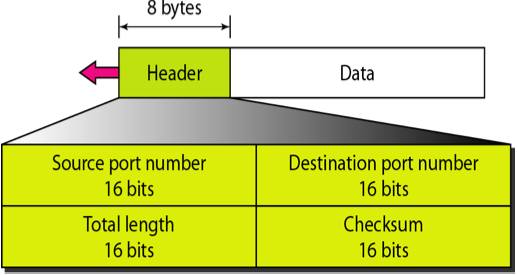
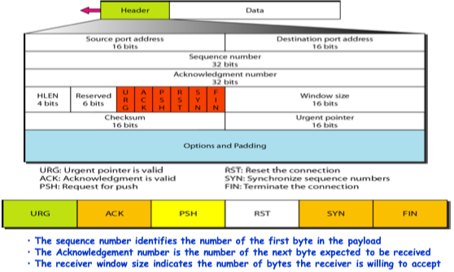
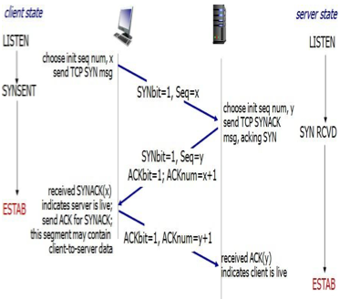
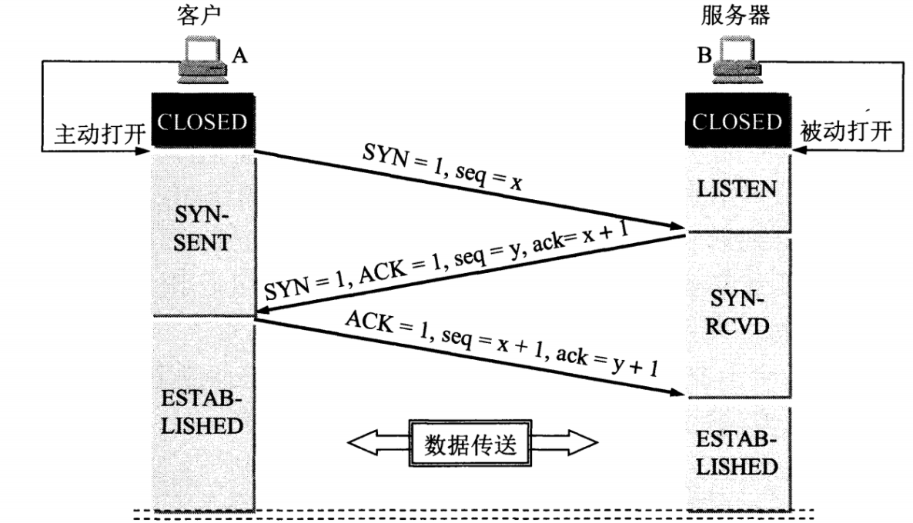
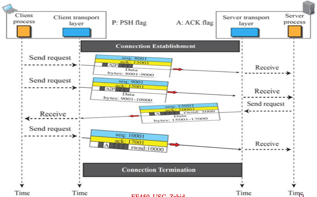
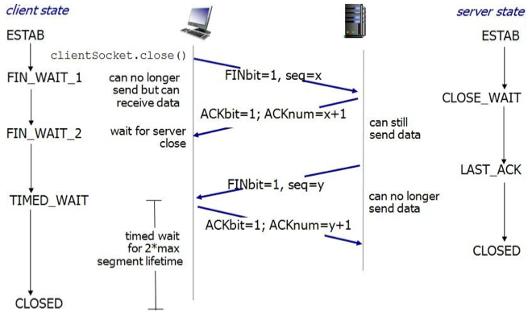
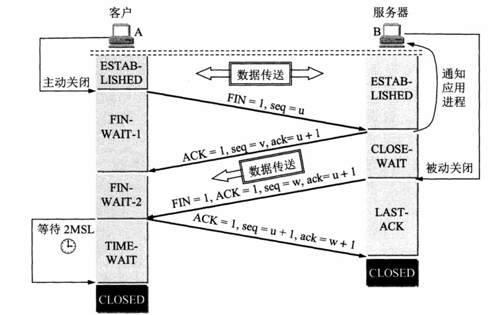
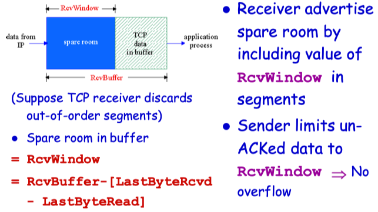
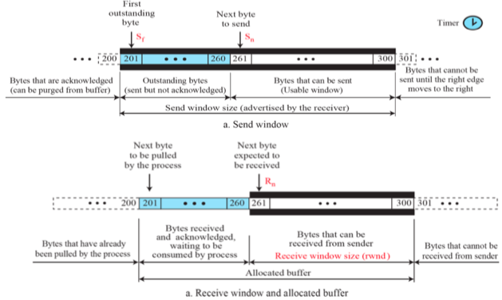

# Transport Layer

- [Transport Layer](#transport-layer)
  - [User Datagram Protocol - UDP](#user-datagram-protocol---udp)
  - [Transport Control Protocol](#transport-control-protocol)

The transport layer provides services to the application layer and takes services from the network layer. The data in the transport layer is referred to as *Segments*. It is responsible for the End to End Delivery of the complete message. The transport layer also provides the acknowledgement of the successful data transmission and re-transmits the data if an error is found. 

**• At sender’s side:**

Transport layer receives the formatted data from the upper layers, performs **Segmentation**, and also implements **Flow & Error control** to ensure proper data transmission. It also adds Source and Destination port numbers in its header and forwards the segmented data to the Network Layer. 

>Note: The sender needs to know the port number associated with the receiver’s application. Generally, this destination port number is configured, either by default or manually. For example, when a web application makes a request to a web server, it typically uses port number 80, because this is the default port assigned to web applications. Many applications have default ports assigned. 

**• At receiver’s side:** 
Transport Layer reads the port number from its header and forwards the Data which it has received to the respective application. It also performs sequencing and reassembling of the segmented data. 

- **Process to process delivery –** 
  While Data Link Layer requires the MAC address (48 bits address contained inside the Network Interface Card of every host machine) of source-destination hosts to correctly deliver a frame and Network layer requires the IP address for appropriate routing of packets, in a similar way Transport Layer requires a Port number to correctly deliver the segments of data to the correct process amongst the multiple processes running on a particular host. A **port number** is a 16-bit address used to identify any client-server program uniquely.
- **End-to-end Connection between hosts –** 
  The transport layer is also responsible for creating the end-to-end Connection between hosts for which it mainly uses TCP and UDP. TCP is a secure, connection-orientated protocol that uses a handshake protocol to establish a robust connection between two end hosts. TCP ensures reliable delivery of messages and is used in various applications. UDP, on the other hand, is a stateless and unreliable protocol that ensures best-effort delivery. It is suitable for applications that have little concern with flow or error control and requires sending the bulk of data like video conferencing. It is often used in multicasting protocols.
- **Multiplexing and Demultiplexing –** 
  Multiplexing allows simultaneous use of different applications over a network that is running on a host. The transport layer provides this mechanism which enables us to send packet streams from various applications simultaneously over a network. The transport layer accepts these packets from different processes differentiated by their port numbers and passes them to the network layer after adding proper headers. Similarly, Demultiplexing is required at the receiver side to obtain the data coming from various processes. Transport receives the segments of data from the network layer and delivers it to the appropriate process running on the receiver’s machine.
- **Congestion Control –** TCP
  Congestion is a situation in which too many sources over a network attempt to send data and the router buffers start overflowing due to which loss of packets occur. As result retransmission of packets from the sources increases the congestion further. In this situation, the Transport layer provides Congestion Control in different ways. It uses **open loop** congestion control to prevent the congestion and **closed loop** congestion control to remove the congestion in a network once it occurred. TCP provides AIMD- additive increase multiplicative decrease, leaky bucket technique for congestion control.
- **Data integrity and Error correction –** 
  The transport layer checks for errors in the messages coming from the application layer by using error detection codes, computing checksums, it checks whether the received data is not corrupted and uses the ACK and NACK services to inform the sender if the data has arrived or not and checks for the integrity of data.
- **Flow control –** 
  The transport layer provides a flow control mechanism between the adjacent layers of the TCP/IP model. TCP also prevents data loss due to a fast sender and slow receiver by imposing some flow control techniques. It uses the method of sliding window protocol which is accomplished by the receiver by sending a window back to the sender informing the size of data it can receive.

## User Datagram Protocol - UDP

* UDP is a connection-less, unreliable end-to-end transport layer protocol that provides

  * Process-to-process communications

  * End-to-end error checking only

* UDP does not provide for end-to-end error or flow control
* UDP services is used by
  * Applications that involves short request/response such as DNS, SNMP, RIP, etc…
  * Applications that can’t tolerate connection-setup delay such as multimedia applications, internet telephony, streaming audio/video, etc...

## Transport Control Protocol - TCP

* TCP is a point-to-point, connection-oriented, reliable, end-to-end protocol that provides 

  * Process-to-process communications 

  * End-to-end error, flow and congestion control  FDX service

* TCP services is used by
  * Applications that can tolerate packet losses but can tolerate the additional delay required to set up the logical connection. Such applications include HTTP, SMTP, FTP, TELNET, etc…
  * The unit of data using TCP is called a Segment

### 1. TCP Connection Set-up

假设 A 为客户端，B 为服务器端。

- 首先 B 处于 LISTEN（监听）状态，等待客户的连接请求。
- A 向 B 发送连接请求报文，SYN=1，ACK=0，选择一个初始的序号 x。
- B 收到连接请求报文，如果同意建立连接，则向 A 发送连接确认报文，SYN=1，ACK=1，确认号为 x+1，同时也选择一个初始的序号 y。
- A 收到 B 的连接确认报文后，还要向 B 发出确认，确认号为 y+1，序号为 x+1。
- B 收到 A 的确认后，连接建立。

**三次握手的原因**

第三次握手是为了防止失效的连接请求到达服务器，让服务器错误打开连接。

客户端发送的连接请求如果在网络中滞留，那么就会隔很长一段时间才能收到服务器端发回的连接确认。客户端等待一个超时重传时间之后，就会重新请求连接。但是这个滞留的连接请求最后还是会到达服务器，如果不进行三次握手，那么服务器就会打开两个连接。如果有第三次握手，客户端会忽略服务器之后发送的对滞留连接请求的连接确认，不进行第三次握手，因此就不会再次打开连接。

### 2. Data Transfer Phase

### 3. Connection termination

以下描述不讨论序号和确认号，因为序号和确认号的规则比较简单。并且不讨论 ACK，因为 ACK 在连接建立之后都为 1。

- A 发送连接释放报文，FIN=1。
- B 收到之后发出确认，此时 TCP 属于半关闭状态，B 能向 A 发送数据但是 A 不能向 B 发送数据。
- 当 B 不再需要连接时，发送连接释放报文，FIN=1。
- A 收到后发出确认，进入 TIME-WAIT 状态，等待 2 MSL（最大报文存活时间）后释放连接。
- B 收到 A 的确认后释放连接。

**四次挥手的原因**

客户端发送了 FIN 连接释放报文之后，服务器收到了这个报文，就进入了 CLOSE-WAIT 状态。这个状态是为了让服务器端发送还未传送完毕的数据，传送完毕之后，服务器会发送 FIN 连接释放报文。

**TIME_WAIT**

客户端接收到服务器端的 FIN 报文后进入此状态，此时并不是直接进入 CLOSED 状态，还需要等待一个时间计时器设置的时间 2MSL。这么做有两个理由：

- 确保最后一个确认报文能够到达。如果 B 没收到 A 发送来的确认报文，那么就会重新发送连接释放请求报文，A 等待一段时间就是为了处理这种情况的发生。
- 等待一段时间是为了让本连接持续时间内所产生的所有报文都从网络中消失，使得下一个新的连接不会出现旧的连接请求报文。

### 4. FLow Control

sender won’t overflow receiver’s buffer by transmitting too much, too fast

### 5. Send Window, Receive Window

### 6. Congestion Control

* The receiver window (advertised window, w a ) ensures that receiver buffer will never overflow, however it does not guarantee that buffers in intermediate routers will not overflow (congestion)
* IP does not provide any mechanism for congestion control. It is up to TCP to detect congestion
* Define another window, called congestion window, w c that determines the maximum number of bytes that can be transmitted without congesting the network
* **Max # of bytes that can be sent = min ( Wa , Wc )**

Tahoe

Reno
